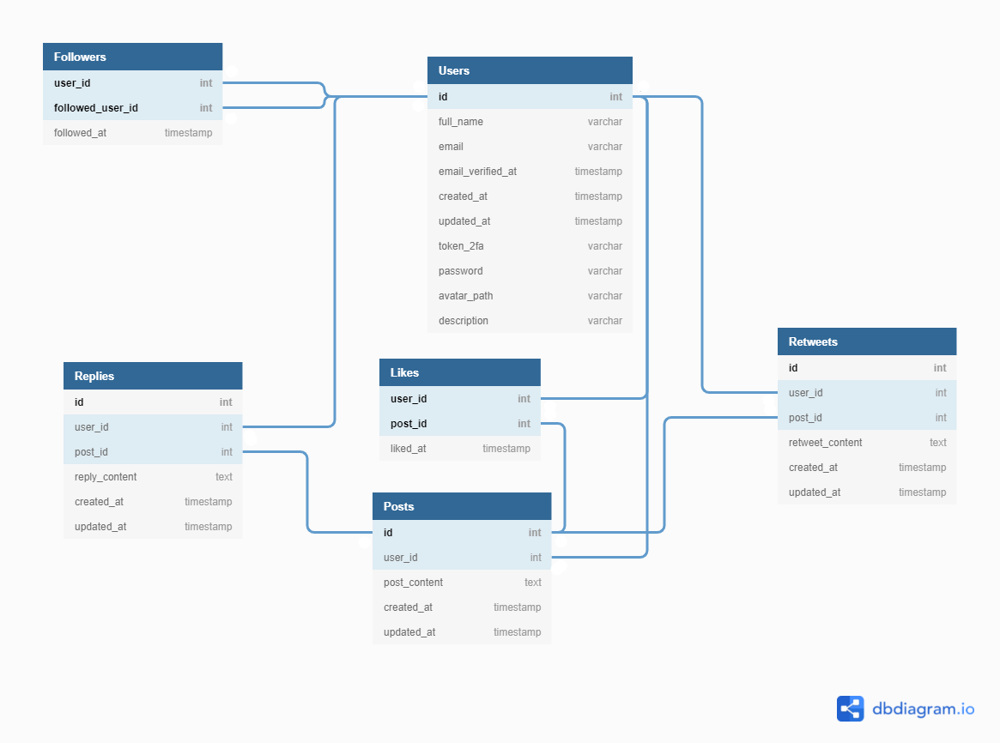

## **Twitter-like** - Advanced Web Programming (CHT2520, Nov. 2021) assignment-01, Patryk Świder, u1971957
This project is a year 3 assignment for Advanced Web Programming.


## Installation
The following installation steps assume you are using XAMPP or a similar environment. For proper functionality, PHP 8 and a MySQL database are required.

### 1. Clone the repo
```
git clone https://github.com/hudds-awp2021-cht2520/assignment-01-patryyq
```


### 2. Install dependencies
```
php composer.phar update
```


### 3. Create .env file
Duplicate the '.env.example' file and rename it to '.env'. 


### 4. Generate app key
Generate app key (APP_KEY in .env) with the following command:

```
php artisan key:generate
```


### 5. Create database
Add a user and create a database with the following settings:
```
Database name: twitter-like
Database user: twitter-like
Database password: s3cur3*p4ssw0rd
Grant the user all privileges = true
```


### 6. Edit .env
In the '.env' file, find the following:
```
DB_CONNECTION=mysql
DB_HOST=127.0.0.1
DB_PORT=3306
DB_DATABASE=laravel
DB_USERNAME=root
DB_PASSWORD=
```

And then change it to:
```
DB_CONNECTION=mysql
DB_HOST=127.0.0.1
DB_PORT=3306
DB_DATABASE=twitter-like
DB_USERNAME=twitter-like
DB_PASSWORD=s3cur3*p4ssw0rd
```


### 7. Create database tables (migrate) and seed
To create needed tables, run the following command:
```
php artisan migrate
```

To populate the above tables, seed the database with the following command:
```
php artisan db:seed
```


### 8. Edit DocumentRoot and Directory path
In the configuration file of your web server, change the DocumentRoot and Directory locations to the 'public' folder. 

In the case of Apache, edit 'httpd.conf' file and locate:
```
DocumentRoot "/xampp's/default/document/root/path"
<Directory "/xampp's/default/directory/path">
```
Then, change paths to the location of the 'public' folder, for example:
```
DocumentRoot "/xampp/htdocs/assignment-01-patryyq/public"
<Directory "/xampp/htdocs/assignment-01-patryyq/public">

```


## Database model



## References

