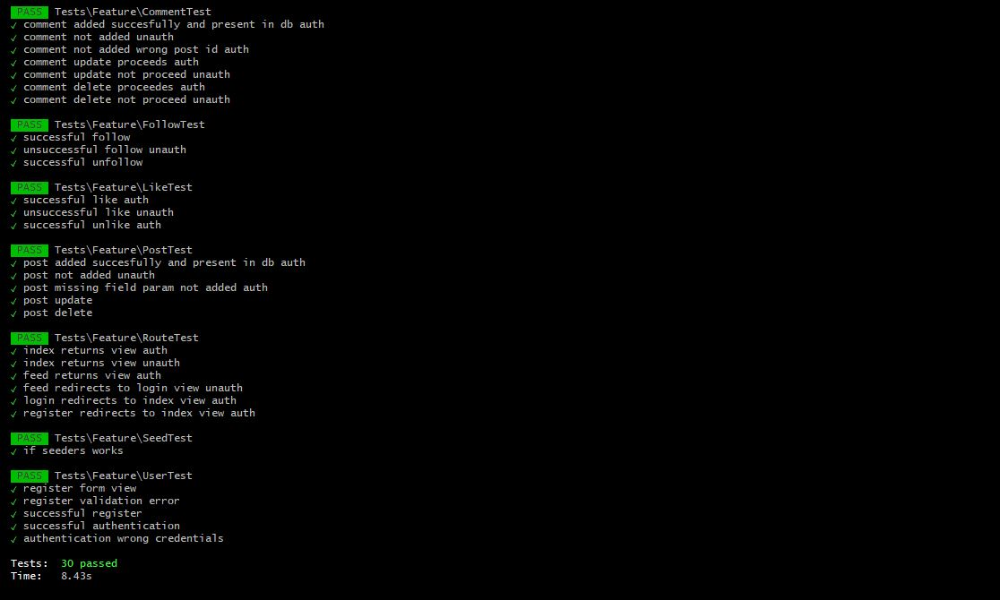

# **Twitter-like** - Laravel driven website
### **Advanced Web Programming (CHT2520), assignment-01 (Nov. 2021), University of Huddersfield** 
**Patryk Świder, u1971957**

# **About the project**

This project is a year 3 assignment for Advanced Web Programming. My task was to create a web application with industry best practices.

The topic was free and the conditions were to include the following operations: CRUD and user authentication, also must use a form of 
persistent storage (database). 
I decided to make a Twitter 'clone' with basic functionality under the name 'Twitter-like' - yeah I know, quite clever...

# **Requirements**
This project is based on a PHP framework - Laravel 8. To work properly it needs a PHP 7.3+ and SQL (MySQL, Postgres, SQLite, SQL Server) environment. Additionally, PHP's dependency manager - Composer. It is required to install all the necessary libraries.

# **Installation**

<iframe width="560" height="315" src="https://www.youtube.com/embed/ZrtqsJIGuzM" title="YouTube video player" frameborder="0" allow="accelerometer; autoplay; clipboard-write; encrypted-media; gyroscope; picture-in-picture" allowfullscreen></iframe>

## 1. Clone the repo
The first step, is to clone the repo by using the following command:
```
git clone https://github.com/hudds-awp2021-cht2520/assignment-01-patryyq
```

## 2. Edit DocumentRoot and Directory path
In a configuration file of your web server, change the DocumentRoot and Directory locations to the 'public' folder. 

In the case of Apache, edit 'httpd.conf' file and locate:
```
DocumentRoot "/xampp's/default/document/root/path"
<Directory "/xampp's/default/directory/path">
```
Then, change paths to the location of the 'public' folder for example:
```
DocumentRoot "/xampp/htdocs/assignment-01-patryyq/public"
<Directory "/xampp/htdocs/assignment-01-patryyq/public">

```
## 3. Install dependencies
Then, install the required dependencies:
```
php composer.phar install
```


## 4. Create .env file
Duplicate the '.env.example' file and rename it to '.env'. In the next steps we will edit it to enable the connection to the database and more.

## 5. Generate app key
Generate app key (APP_KEY in .env) with the following command:

```
php artisan key:generate
```


## 6. Create database
Add a user and create a database in your RDBMS of choice, with the following settings:
```
Database name: twitter-like
Database user: twitter-like
Database password: s3cur3*p4ssw0rd
Create database with same name and grant all privileges: true
```


## 7. Edit .env
In the '.env' file, find the following:
```
DB_CONNECTION=mysql
DB_HOST=127.0.0.1
DB_PORT=3306
DB_DATABASE=laravel
DB_USERNAME=root
DB_PASSWORD=
```

And then change it accordingly to your needs. Below is an example using MySQL:
```
DB_CONNECTION=mysql
DB_HOST=127.0.0.1
DB_PORT=3306
DB_DATABASE=twitter-like
DB_USERNAME=twitter-like
DB_PASSWORD=s3cur3*p4ssw0rd
```
The credentials above and in Step 5 are just examples, you can choose any you like.

## 8. Create database tables (migrate)
To create needed tables, run the following command:
```
php artisan migrate
```

## 9. Run tests
To make sure everything is working properly, run tests with the following:

```
php artisan test
```
Running the tests will erase all the data in your database. Each time it is necessary to run the seed command (Step 10).

A list of all tests is below in the "List of tests" section.

## 10. Seed the database
Finally, the last step. To populate the above tables, seed the database with the following command:
```
php artisan db:seed
```
# **Features and basic usage**
After using the 'db:seed' command, there are dozens of users, hundreds of likes, comments, followers and posts in the database. 
There are 2 accounts available - admin and user, also dozens of random accounts. Admin can edit and delete all of the content. Users can edit and delete only their stuff.

### **Admin:**
```
email: admin@email.com
password: password
```

### **User:**
```
email: user@email.com
password: password
```
## **Features:**
### 1. Follow users
### 2. Write posts
### 3. Like posts
### 4. Write comments
### 5. Explore random users
### 6. Browse all posts
### 7. Browse only posts of followed users
### 8. Login / Logout
### 9. Registeration
### 10. Create/Read/Update/Delete of all content (if authorized)

# **List of tests**



# **Database model**


