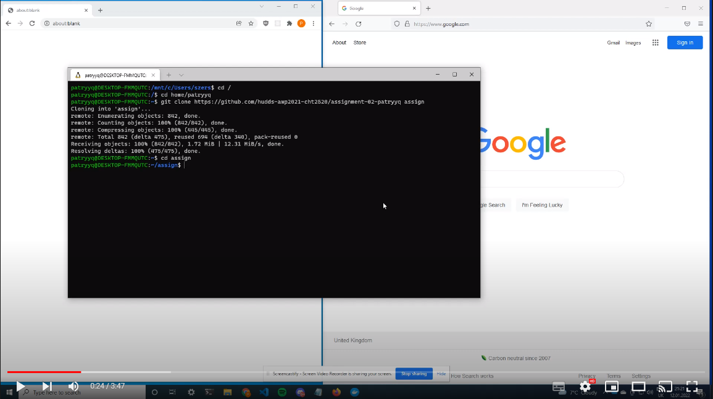
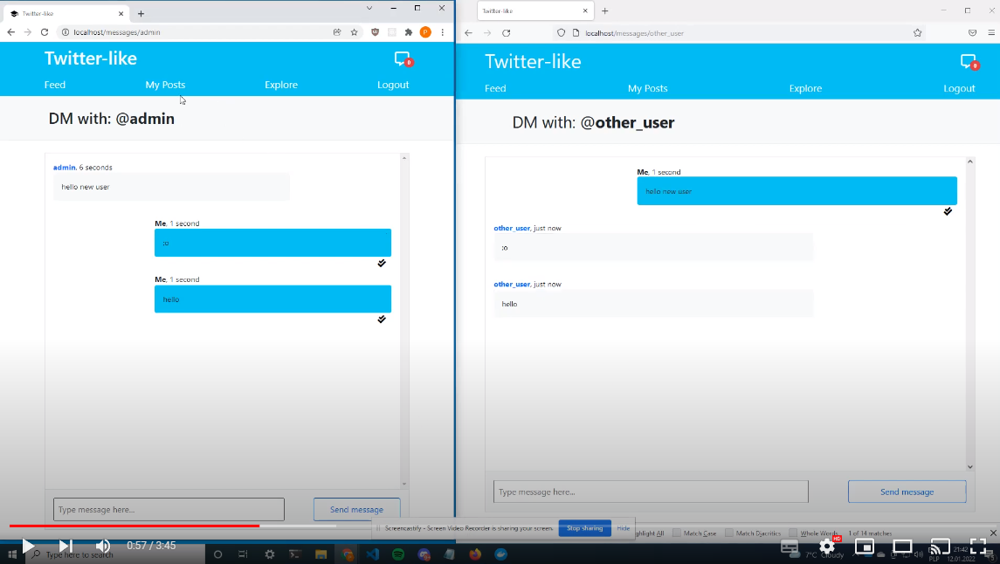

# **Twitter-like** - Laravel driven website
### **Advanced Web Programming (CHT2520), assignment-01 (Jan. 2022), University of Huddersfield** 
**Patryk Świder, u1971957**

# **About the project**

This project is a year 3 assignment for Advanced Web Programming. My task was to create a web application with industry best practices.

The topic was free and the conditions were to include the following operations: CRUD and user authentication, also must use a form of 
persistent storage (database). 
I decided to make a Twitter 'clone' with basic functionality under the name 'Twitter-like' - yeah I know, quite clever...

# **Technologies**
* Laravel 8
* Laravel Sail
* Bootstrap 5
* MySQL
* Websockets
* PHPUnit 
* Docker

# **Requirements**
* PHP 8
* Docker

As the application runs on Docker, there are not many requirements. All you need is PHP to install the dependencies and Docker to take care of the rest.

# **Installation**
## Installation video
[](https://www.youtube.com/watch?v=ZrtqsJIGuzM)

## 1. Clone the repo
The first step, is to clone the repo by using the following command:
```
git clone https://github.com/hudds-awp2021-cht2520/assignment-02-patryyq
```
## 2. CD into the project directory:
```
cd assignment-02-patryyq
```
## 3. Create and edit.env file
Duplicate the '.env.example' file and rename it to '.env'. 

In the '.env' file, find the following:
```
DB_DATABASE=laravel
DB_USERNAME=root
DB_PASSWORD=
```
And then change it accordingly to your needs, eg:
```
DB_DATABASE=twitter-like
DB_USERNAME=twitter-like
DB_PASSWORD=s3cur3*p4ssw0rd
```
The credentials above are just example, you can choose any you like.

## 4. Install dependencies
Then, install the required dependencies:
```
php composer.phar install
```

## 5. Add alias for Laravel's Sail
```
alias sail='[ -f sail ] && bash sail || bash vendor/bin/sail'
```
## 6. Build and run
Run commands to build and start Docker using Sail

First:
```
sail build
```
Then:
```
sail up -d
```

## 7. Generate app key
Generate app key (APP_KEY in .env) with the following command:
```
sail artisan key:generate
```

## 8. Create database tables (migrate)
To create needed tables, run the following command:
```
sail artisan migrate
```

## 9. Run tests
To make sure everything is working properly, run tests with the following:

```
sail test
```
Running the tests will erase all the data in your database. Each time it is necessary to run the seed command (Step 10).

A list of all tests is below in the "List of tests" section.

## 10. Seed the database
To populate the above tables, seed the database with the following command:
```
sail artisan db:seed
```

## 11. Add symbolic storage link
Finally, the last step
```
sail artisan storage:link
```

# **Features and basic usage**
After using the 'db:seed' command, there are dozens of users, hundreds of likes, comments, followers and posts in the database. 
There are 2 accounts available - admin and user, also dozens of random accounts. Admin can edit and delete all of the content. Users can edit and delete only their stuff.
## More details are explained in the videos below
### **Admin:**
```
email: admin@email.com
password: password
```

### **User:**
```
email: user@email.com
password: password
```
## **Features:**
## Features video #1
[](https://www.youtube.com/watch?v=iB4KGAsnGBs)

## Features video #2
[](https://www.youtube.com/watch?v=x6SyZ-mx1xY)


### 1. Follow users
### 2. Write posts
### 3. Like posts
### 4. Write comments
### 5. Explore random users
### 6. Browse all posts
### 7. Browse only posts of followed users
### 8. Login / Logout
### 9. Registeration
### 10. Create/Read/Update/Delete of all content (if authorized)
### 11. Write and receive message
### 12. Live notifications with websockets
### 13. Forgot password / reset password
### 14. Upload/change pofile image
### 15. Message status read/unread with websockets
### 16. Login with 2FA

# **List of tests**


# **Database model**


# **References**
## 1. Uploading images:
### thedataops.org, 2021. [Used this article to make upload image feature. ](https://www.thedataops.org/laravel-avatar-image-upload-tutorial-with-example/ "Used this article to make upload image feature. ")

## 2. Laravel websockets:

### beyondco.de, 2021. [Laravel websockets package. ](https://beyondco.de/docs/laravel-websockets/getting-started/introduction "Used this article to make websockets. ")

### christoph-rumpel.com, 2020. [Websockets tutorial. ](https://christoph-rumpel.com/2020/11/laravel-real-time-notifications "Laravel Real-Time Notifications")


# **Reflections**

Thanks to this project I finally got to experience the long known to me technologies: Docker and Websockets. I have heard about them many times but never had the 'opportunity' to try.

I have once again been enlightened by learning about the 'game changing', as I did earlier with GIT, NPM, Composer, React, Linux etc. - a big step forward compared to previously known technologies.

Docker allows you to set up the entire environment configuration once and for all. These settings can then be reproduced anywhere without worrying about missing dependencies. The only thing you need to use Docker is Docker itself...

Websockets, on the other hand, give the possibility of a continuous connection between client and server and the immediate sending/receiving of events without the need for continuous 'control' requests. 
This is like a server in games, where the server and client are constantly exchanging information with each other without heavy load.

I am very interested in both technologies and will definitely come back to them. Thanks to Docker I don't have to worry about setup - which in the case of local dev is not so bad yet, but the problems start when it comes to deployment. Websockets on the other hand give great opportunities, especially in the era of rapid development of 5G - faster connections (less lag) - bette 'live' experience.
